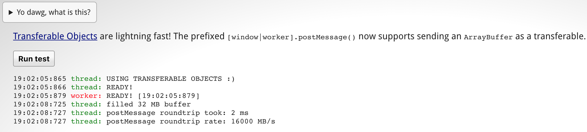

# 结构化克隆算法 & 可转移对象(Structured Clone Algorithm & Transferable Objects)

* [结构化克隆算法](#structured-clone-algorithm)
	* [结构化克隆优于 JSON 的地方](#benefits-over-JSON)
	* [结构化克隆算法不能复制的对象](#structured-clone-algorithm-cannot)
* [Transferable](#transferable)
	* [如何使用 Transferable](#how-to-use-transferable)
	* [Transferable 的优点](#transferable-good-part)
	* [Transferable 的不足](#transferable-bad-part)
* [参考链接](#related-links)
* [作者信息](#author)

如果前端页面会通过 JavaScript 进行大量的计算，并且要将计算结果实时更新渲染在页面上时，为了避免大量的计算(**比如消息队列(mqtt) 返回二进制并转换**)占用主线程导致渲染更新延迟，比较好的实现方式应该是通过 **web worker** 创建一个新的线程，把计算交给 worker 来执行，在执行结束后将结果返回给主线程并通知主线程更新页面。

例如，我们将与消息队列的通信、数据处理逻辑放在 `worker.js` 文件中，我们通过下面的代码创建一个 worker：

```javascript
let w = new Worker('path/to/worker.js');
```

上面的代码会在另外一个线程中加载 `worker.js` 并执行其中的代码。为了在主线程和 worker 之间进行通讯，HTML5 开放了 `Worker.postMessage()` 接口，该接口的签名如下：

```javascript
Worker.postMessage(aMessage);
```

`postMessage()` 接口的参数为支持 [结构化克隆](https://developer.mozilla.org/en-US/docs/Web/API/Web_Workers_API/Structured_clone_algorithm) 的对象；该种对象由结构化的克隆算法生成，接下来我们看一下什么是结构化的克隆算法：

## <span id="structured-clone-algorithm">结构化克隆算法(Structured Clone Algorithm)</span>

> The structured clone algorithm is an algorithm [defined by the HTML5 specification](http://www.w3.org/html/wg/drafts/html/master/infrastructure.html#safe-passing-of-structured-data) for copying complex JavaScript objects. It is used internally when transferring data to and from [Workers](https://developer.mozilla.org/en-US/docs/Web/API/Worker) via [postMessage()](https://developer.mozilla.org/en-US/docs/Web/API/Worker/postMessage) or when storing objects with [IndexedDB](https://developer.mozilla.org/en-US/docs/Glossary/IndexedDB). It builds up a clone by recursing through the input object while maintaining a map of previously visited references in order to avoid infinitely traversing cycles. &nbsp;&nbsp;&nbsp;&nbsp;&nbsp;&nbsp;&nbsp;&nbsp;&nbsp;&nbsp;&nbsp;&nbsp;&nbsp;&nbsp;&nbsp;&nbsp;&nbsp;&nbsp;&nbsp;&nbsp;&nbsp;&nbsp;&nbsp;&nbsp;&nbsp;&nbsp;&nbsp;&nbsp;&nbsp;&nbsp;&nbsp;-- MDN

上面是 MDN 上关于结构化克隆算法的定义：该算法由 HTML5 规范定义，用于拷贝复杂的 JavaScript 对象。浏览器内部会在通过 [postMessage()](https://developer.mozilla.org/en-US/docs/Web/API/Worker/postMessage) 传递数据或者 [IndexedDB](https://developer.mozilla.org/en-US/docs/Glossary/IndexedDB) 中存储对象时自动应用结构化克隆算法。

在没有该算法之前，与 Worker 进行通讯只能传递字符串(包括 JSON 字符串)；而与 Worker 进行通讯的过程中，[postMessage()](https://developer.mozilla.org/en-US/docs/Web/API/Worker/postMessage) 方法的第一个参数的内容是被复制一份传递的，而不是共享的，这就会产生一个问题：不能解决相互依赖的问题，以及不能不能传递 RegExp、Blob、File 等类型的数据。

结构化克隆算法解决了上面的问题，不仅支持传递 RegExp、Blob、File 等类型的数据，而且比 JSON 字符串更高效；而且该算法会递归遍历要传递的对象，并且会维护一个 map，用来避免无限循环的引用。

### <span id="benefits-over-JSON">结构化克隆优于 JSON 的地方</span>

* 可以复制 **RegExp** 对象
* 可以复制 **Blob**、**File**、**FileList** 对象
* 可以复制 **ImageData** 对象
* 可以复制相互依赖的对象

### <span id="structured-clone-algorithm-cannot">结构化克隆算法不能复制的对象</span>

* **Error**、**Function** 对象；尝试复制会抛出 **DATA_CLONE_ERR** 异常；
* **DOM**；尝试复制会抛出 **DATA_CLONE_ERR**异常；
* 对象的特定参数(属性)是保留的：
	* **RegExp** 对象的 **lastIndex** 属性；
	* 属性描述符、setters、getters；例如，如果一个对象的某个属性是只读的，但是复制后的对象的该属性是可读写的，因为属性描述符是保留的，而属性可读写是默认选项；
	* 原型链(**prototype chain**) 不会被遍历，也不会被复制

## <span id="transferable">Transferable</span>

[postMessage()](https://developer.mozilla.org/en-US/docs/Web/API/Worker/postMessage) 的本质是拷贝一份参数(JavaScript 对象)传递到 Worker 环境中，结构化克隆算法提供了克隆复杂对象的算法，功能很强大，但是美中不足的是数据传递速度比较慢：传递 32MB 的 **ArrayBuffer** 到 Worker 中要耗费几百毫秒的时间；而在新版本的浏览器中，提供了更快的方式：[Transferable](https://developer.mozilla.org/en-US/docs/Web/API/Transferable) 接口。

**Transferable** 接口表示可以在不同执行环境之间传递的对象类型，这是一个抽象接口，并没有具体的实现对象。该接口不定义任何方法或者属性，只由其他类型的对象继承之后实现。**Transferable** 接口仅仅是一个 tag，用来标识一种对象可用于特定的环境。

使用 **Transferable** 需要注意的是，该类型的对象是直接从一个执行环境转移到另外一个执行环境的，省略了拷贝的步骤，因此极大地提升了传输速度。传递之后，接收的环境中会收到该对象，原来环境中的该对象会消失，不能再使用。传递 **Transferable** 对象的过程像是 C/C++ 中的引用传递，但是不同的地方是原环境中的对象不允许再使用。这样做的目的同结构化克隆算法一样，即保持两个执行环境中数据的相互独立，避免出现一个执行环境可以修改另外一个执行环境中数据的情况。

### <span id="how-to-use-transferable">如何使用 Transferable</span>

**Transferable** 对象的传递不需要特殊的处理，**postMessage()** 方法的新版本提供了一个额外的参数，用来罗列要使用 **Transferable** 传递的数据：

```javascript
worker.postMessage(aMessage, [transferableList]);
```

### <span id="transferable-good-part">Transferable 的优点</span>

传递速度快：32MB 普通数据传递需要几百毫秒，而 32MB 支持 **Transferable** 接口的 **ArrayBuffer** 数据在主线程和 Worker 之间传递一个来回消耗的时间为 2ms，[Demo](http://html5-demos.appspot.com/static/workers/transferables/index.html) 结果如下:



### <span id="transferable-bad-part">Transferable 的不足</span>

浏览器中实现该接口的数据类型比较少，大多数的类型没有实现 Transferable 接口，所以普通的数据类型智能使用 **结构化克隆算法** 复制后传递。支持 Transferable 接口的数据类型如下：

* [ArrayBuffer](https://developer.mozilla.org/en-US/docs/Web/JavaScript/Reference/Global_Objects/ArrayBuffer)
* [MessagePort](https://developer.mozilla.org/en-US/docs/Web/API/MessagePort)
* [ImageBitmap](https://developer.mozilla.org/en-US/docs/Web/API/ImageBitmap)

在普通场景下，使用 **Transferable** 并不一定划算：首先需要将数据转换为上面三种类型中的一种才能使用，传递之后还需要再转换为原来的数据类型，这之间的开销说不准就比传递节省的时间还要多。

从上面支持的数据类型来看，其实 **Transferable Objects** 主要的使用场景是在 Web Worker 中处理 [webGL](https://developer.mozilla.org/en-US/docs/Web/API/WebGL_API/Tutorial) 和 [canvas](https://developer.mozilla.org/en-US/docs/Web/API/Canvas_API/Tutorial) 使用的数据，处理完之后的数据类型为 ArrayBuffer 或者 ImageBitmap 类型，然后传递给主线程渲染使用。通常 **webGL** 和 **canvas** 使用的数据类型体积比较大，使用普通的通信方式需要的时间比较长；而使用 **Transferable** 传递的时间可以忽略不计，可以大大减少在传递过程中消耗的时间。

## <span id="related-links">参考链接 🔗</span>

* [The structured clone algorithm](https://developer.mozilla.org/en-US/docs/Web/API/Web_Workers_API/Structured_clone_algorithm)
* [Transferable Objects: Lightning Fast!](https://developers.google.com/web/updates/2011/12/Transferable-Objects-Lightning-Fast)
* [Transferable](https://developer.mozilla.org/en-US/docs/Web/API/Transferable)
* [The structured clone algorithm](http://mdn.beonex.com/en/DOM/The_structured_clone_algorithm.html)

## <span id="author">作者信息 🐶</span>

* [GitHub](hppts://github.com/Tao-Quixote)
* Email：<web.taox@gmail.com>