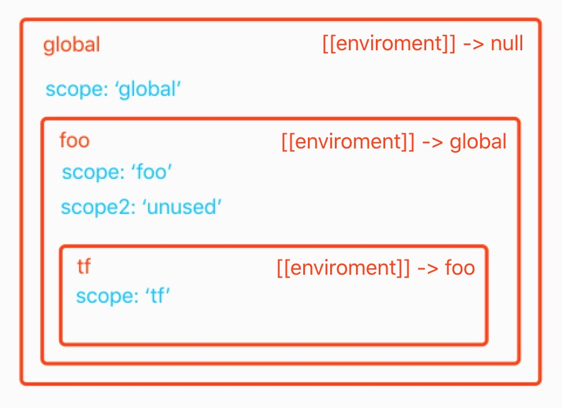

# 闭包(closure) 中的垃圾回收

闭包(closure) 是什么这里就不讲了。(* _ *)

## 词法作用域(lexical environment)

词法作用域相关的知识请跳转 [词法作用域（Lexical Environment）](http://understand-es-by-ecma262.taojihede.com/documents/base-concept/lexical-environment)。

## 垃圾回收机制

示例代码：

```javascript
// global 作用域
let scope = 'global'

function foo () {
	let scope = 'foo'
	let scope2 = 'unused'
	
	return function tf () {
		// let scope = 'tf'
		console.log(scope)
		debugger
	}
}

let tf = foo()
```
上面代码的词法作用域嵌套如下图所示：



**注：上面的 enviroment 书写错误，应为 environment。**

词法作用域其实是一个对外不可见的内部对象，其中保存着当前作用域的 **环境记录(Environment Records)** 以及当前词法作用域的外层词法作用域。词法作用域被 GC 回收的时机与普通 JavaScript 对象一样：当对象不再被引用时，浏览器的 GC 会将该对象占用的内存释放掉；当一个词法作用域不再被其他词法作用域引用时，该词法作用域同样会被 GC 回收掉（Global Lexical Environment 会一直存在，不会被释放）。

保存在对象中的属性，不管是引用数据类型还是基本数据类型，只要该对象不被回收，其中的属性也不会被 GC 回收掉。**理论上**，词法作用域虽然是一个不对外暴露的内部对象，但是其中的属性(包括 let/const/var 声明的变量以及对象)应该同普通对象的属性一样，只要词法作用域对象存在，其中的属性也应该保留。

当然，只是理论上而已，现实中 ECMAScript 引擎的实现却不是这样的。

在执行 `foo()` 时，引擎会为函数 `foo` 生成一个词法作用域对象，其中保存着两个变量：`scope` 和 `scope2`，并在函数执行的末尾将函数 `tf` 的引用返回；返回的 `tf` 函数在内部有自己的 [[Environment]] 属性，其中保存着对外层词法作用域对象（foo 函数执行的词法作用域）的引用。因为函数 `foo` 的词法作用域对象存在引用，所以该词法作用域对象会一直保存在内存中。

在实际执行 `tf()` 时，因为 `tf` 指向的函数中引用了函数 `foo` 的词法作用域对象中的 `scope` 变量，所以 `scope` 变量不会被 GC 回收掉。理论上来说词法作用域中的 `scope2` 变量作为词法作用域的属性也不该被 GC 回收，但是实际执行时(在 V8 引擎中)，GC 判断 `scope2` 没有被引用，所以会在 `foo()` 执行完之后，将 `scope2` 变量从词法作用域对象中删除，并释放其所占用的内存。

例：

```javascript
function foo () {
	let scope = 'foo'
	let scope2 = 'unused'
	
	return function tf () {
		// let scope = 'tf'
		console.log(scope)
		debugger
	}
}

let tf = foo()
tf()
```

上面的代码在执行到 `debugger` 这一行时会暂停，此时如果在控制台中尝试使用 `scope2` ，JS 引擎会抛出一个 `ReferenceError`，因为此时 `scope2` 变量已经被 GC 回收掉了。

这种优化虽然跟规范中规定的不一致，但是可以减少内存占用，也不会影响代码的正常。只有在 debug 的时候可能会引起“误会”。

## 参考链接

* [Executable Code and Execution Contexts](https://tc39.github.io/ecma262/#sec-executable-code-and-execution-contexts)
* [Closure](https://javascript.info/closure)

## 作者信息 🐥

* [GitHub](https://github.com/Tao-Quixote)
* e-mail: <web.taox@gmail.com>